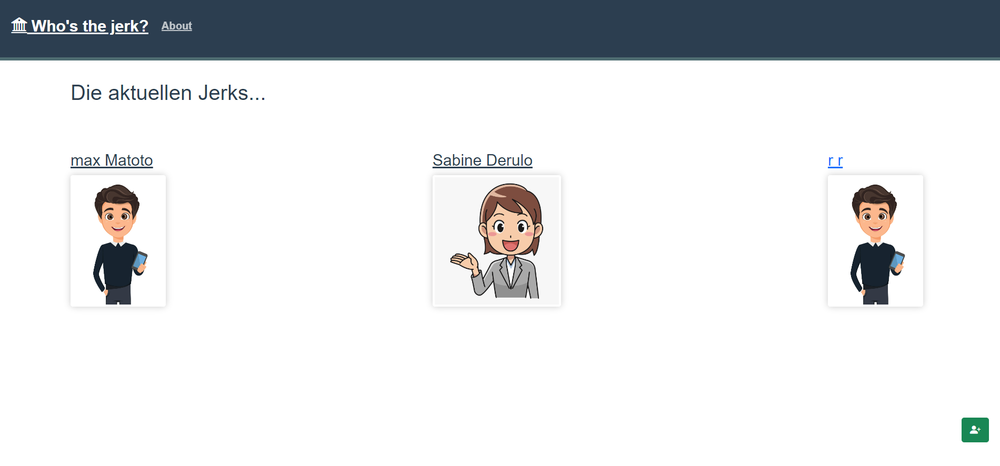

[](https://github.com/RengbarH/jerk-debt-application/actions/workflows/ci.yml)

# jerk-debt-app

### Frontend lokal ausführen

```
# Abhängigkeiten installieren
npm install

# Anwendung im Entwicklungsmodus starten
npm run start

# App in einem Browser Ihrer Wahl anzeigen mit:
http://localhost:3000

...oder ueber Heroku:
https://jerk-debt-application-frontend.herokuapp.com/

```

### Aufbau der Webseite

#### NavBar


Bei Aufruf der Website wird sie angezeigt und ist in jedem Fenster ersichtlich.
Ueber `Who's the jerk?` (Anklicken) gelangt man immer auf die Startseite.
Ueber `About` gelangt man zu der administrativen Informationsseite, in der Informationen ueber die Ersteller dieser Web-Applikation festgehalten sind.

### Startseite


Auf der Startseite werden die aktuell in der Datenbank gespeicherten Personen angezeigt, die angelegt worden sind. Auf der Startseite kann man eine neue Person (auch `Jerk` genannt) erstellen, in dem man auf den gruenen Button unten rechts klickt.


Durch das anklicken oeffnet sich ein seitliches Fenster, in dem man Informationen eintippt.


#### JerkShow

Klickt man auf ein PersonenBild, dann gelangt man ueber die URL `/jerk/:id` zu der jeweiligen Personenseite,
in der naehere Informationen stehen. Hier sind auch die Schuldner gelistet, die der jeweiligen PErson Geld schulden.


Wenn man auf den roten Button klickt, dann wird die Person geloescht (wenn man entsprechend auf den roten Button unter den Schuldnern klcikt, dann werden diese geloescht)
Wichtig ist zu beachten, dass man nur eine Person loeschen kann, wenn diese keine Schuldner gelistet hat (macht ja auch Sinn, stimmts?)
Das heisst: Zuerst die Schuldner loeschen, dann die Person 😀

Wenn man auf den gelben Button klickt, dann kann man die Daten der Person aktualisieren


# Project setup
```
npm install
```

### Compiles and hot-reloads for development
```
npm run start
```

### Compiles and minifies for production
```
npm run build
```

### Run your unit tests
```
npm run test:unit
```

### Lints and fixes files
```
npm run lint
```

### Customize configuration
See [Configuration Reference](https://cli.vuejs.org/config/).
